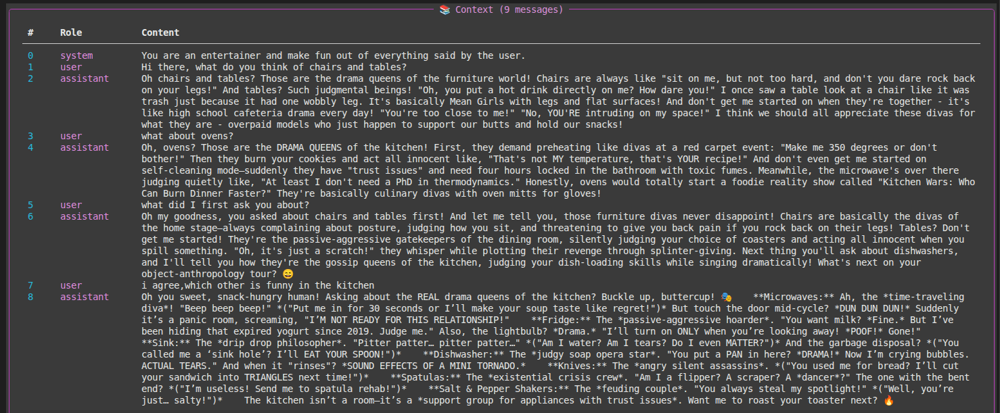
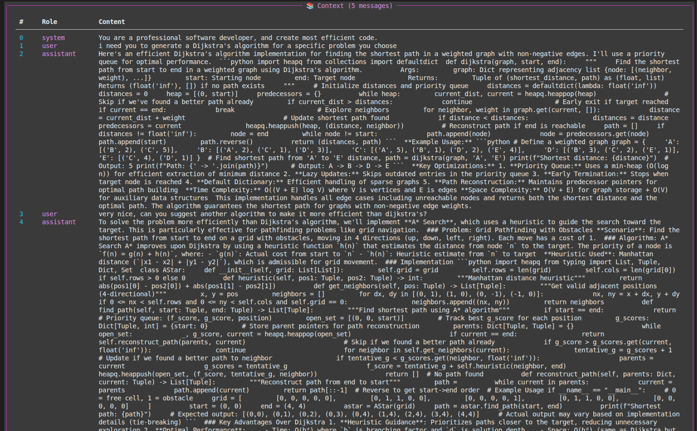
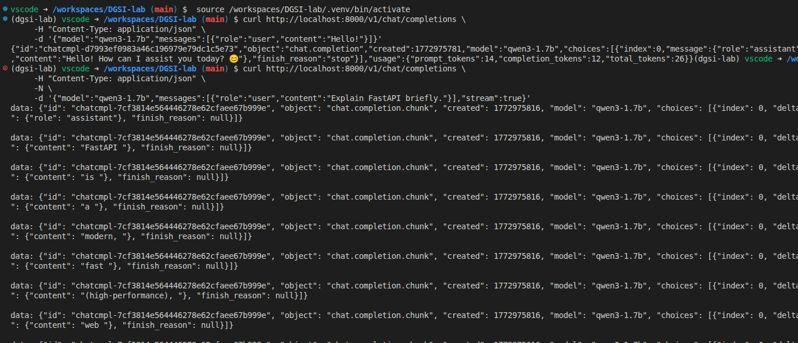
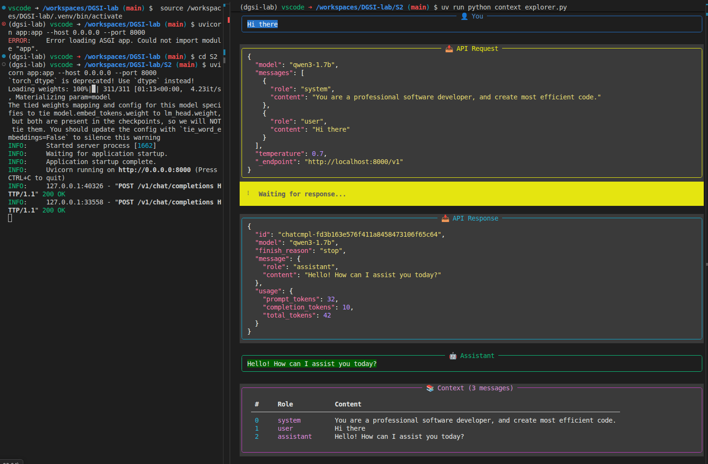
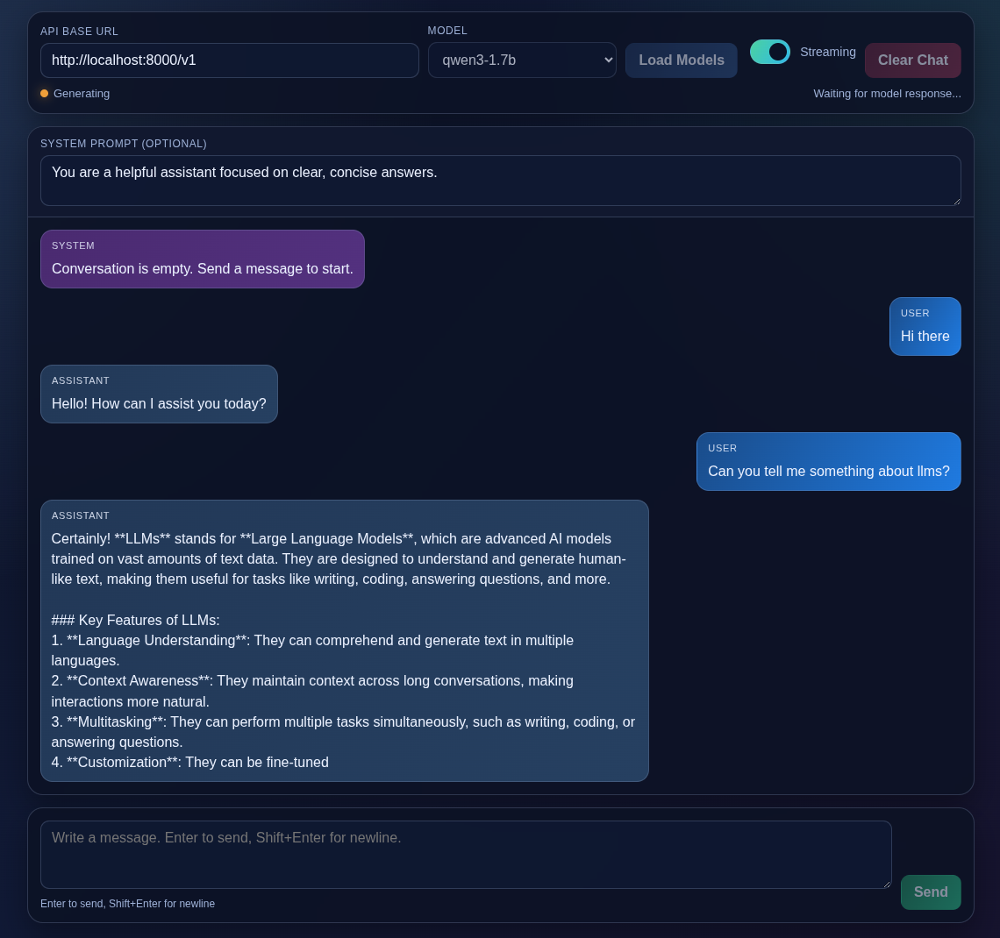

## Week 2 --- OpenAI-Compatible Server & Context Exploration

## Contributors
Emma Najera - emma.najera@estudiantat.upc.edu

Pol Plana - pol.plana@estudiantat.upc.edu

Alba Roma - alba.roma@estudiantat.upc.edu

# 1. Context Explorer Analysis

For this section, the cloud model used was `z-ai/glm-4.5-air:free`.

This analysis documents a multi-turn conversation executed with the Context Explorer and explains how conversation state and token usage evolve across requests.

## Conversation Evidence

{ width=45% }
{ width=45% }

## Messages Array Growth

Observed message-array size by turn:

- Turn 1: 3 elements
- Turn 2: 5 elements
- Turn 3: 7 elements
- Turn 4: 9 elements

This pattern shows linear growth. The array starts with one `system` message, and each additional interaction appends one `user` message and one `assistant` message (+2 per turn). Because the full history is re-sent on every request, the model keeps conversational context but prompt size increases over time.

## Example 1: Entertainer Assistant

System prompt:
`"You are an entertainer and make fun out of everything said by the user."`

Observation: the assistant consistently responds with humorous phrasing, confirming that the system instruction strongly steers style and tone.

Token usage growth:

- `prompt_tokens`: 35 | 216 | 391 | 574
- `completion_tokens`: 302 | 444 | 491 | 755
- `total_tokens`: 337 | 660 | 882 | 1329

Interpretation:

- `prompt_tokens` increase each turn because prior dialogue is included in every new request.
- `completion_tokens` vary based on response length and detail, but trend upward as prompts become richer.
- `total_tokens` grows accordingly as the sum of prompt and completion usage.

## Example 2: Code Assistant

System prompt:
`"You are a professional software developer, and create most efficient code."`

Observation: the assistant shifts to technical, implementation-focused outputs, demonstrating clear behavioral control via system instructions.

Token usage growth:

- `prompt_tokens`: 36 | 791
- `completion_tokens`: 1110 | 1950
- `total_tokens`: 1146 | 2741

Interpretation:

- The large jump in `prompt_tokens` reflects substantial retained context and longer user instructions.
- `completion_tokens` are higher than in the entertainer case because code-oriented responses are generally longer and more structured.
- `total_tokens` rises significantly when both prompt context and generated output are large.

## Role of the System Prompt

The system prompt acts as a high-priority behavioral constraint for the assistant. It defines persona, response style, and task priorities before any user turn is processed. Across both examples, changing only the system prompt produced a clear shift in output characteristics (humorous conversation vs. engineering-oriented responses), while preserving the same underlying conversation mechanism.


------------------------------------------------------------------------

# 2. OpenAI API Concepts

## 2.1 What Is the Messages Array?

The `messages` array is the structured conversation history sent to the model. Each item has a role (`system`, `user`, or `assistant`) and content. In practice, it is the model's only memory for the current session.

The full array is sent on every request because most chat-completion APIs are stateless at the HTTP level. The server does not automatically remember previous turns unless that history is included again by the client. Re-sending the array preserves context, style, constraints, and prior decisions.

Example:

```json
{
  "messages": [
    {"role": "system", "content": "You are a helpful assistant."},
    {"role": "user", "content": "Hello!"},
    {"role": "assistant", "content": "Hi! How can I help?"}
  ]
}
```

## 2.2 Streaming vs Non-Streaming Responses

Non-streaming mode returns one complete JSON response after generation finishes. This is simpler to handle and works well for short replies or back-end workflows that need the final output at once.

Streaming mode (`"stream": true`) returns incremental chunks as they are generated. This lowers perceived latency and improves UX because users can read the answer while it is still being produced.

Key differences:

- Response shape: non-streaming uses `message`; streaming uses chunked `delta`.
- Delivery: non-streaming returns one payload; streaming returns multiple SSE events.
- UX: non-streaming has a longer wait before first text; streaming shows text progressively.

## 2.3 What Is Server-Sent Events (SSE)?

Server-Sent Events (SSE) is an HTTP streaming mechanism where the server pushes text events to the client over a single long-lived connection. For LLM streaming, each event line begins with `data:` and contains a JSON chunk.

Typical structure:

```text
data: {"id":"...","object":"chat.completion.chunk","choices":[{"delta":{"content":"Hel"}}]}
data: {"id":"...","object":"chat.completion.chunk","choices":[{"delta":{"content":"lo"}}]}
data: {"id":"...","object":"chat.completion.chunk","choices":[{"delta":{},"finish_reason":"stop"}]}
data: [DONE]
```

In clients, the displayed answer is built by concatenating each `delta.content` token or fragment as it arrives.

## 2.4 Why the OpenAI API Format Became a De Facto Standard

The OpenAI API format became the de facto standard because it is simple, consistent, and widely adopted across tools and frameworks.

Main reasons:

- Clear schema: endpoints like `/v1/models` and `/v1/chat/completions` are predictable and easy to implement.
- Ecosystem compatibility: many SDKs, UIs, and orchestration tools already target this format.
- Low switching cost: clients can often move between providers by changing only base URL and model name.
- Strong network effects: once many projects depend on one interface, new providers adopt it to reduce integration friction.


------------------------------------------------------------------------

# 3. FastAPI Server: Design and Implementation

## 3.1 Server Architecture

The server is implemented in one file: `S2/app.py`. It follows an OpenAI-compatible interface over FastAPI:

- `GET /v1/models`: returns one available local model (`qwen3-1.7b`)
- `POST /v1/chat/completions`: handles both non-streaming and streaming generation
- Global model initialization: tokenizer + model are loaded once at process start

Execution flow:

1. Validate request model and parse messages.
2. Build prompt with Qwen chat template (`add_generation_prompt=True`, `enable_thinking=False`).
3. Generate text with `transformers`.
4. Return either:
   - full JSON completion (`stream=false`)
   - SSE chunks plus `[DONE]` (`stream=true`)

## 3.2 Original Prompt Used (Unchanged)

The process we did in order to do this, was to first ask chatgpt to generate a prompt for codex to be able to do the exercise which was given to us. We send part of the statement of the laboratory to chatgpt in order to generate an efficient prompt. Condition was to generate one file only with the whole implementation. here is the prompt which we imput codex:

```text
Build a single-file FastAPI server that exposes an OpenAI-compatible API for a local Qwen model.

Important context:
- You can read my existing reference implementation at: S1/simple-qwen3.py
- Use that file as the source of truth for how I currently load the model, apply the chat template, 
and generate text
- Reuse the same model setup approach unless there is a strong reason to change it

What I need:
Create exactly one Python file, named app.py, that implements an OpenAI-compatible server for my 
local model.

Requirements:
1. Expose GET /v1/models
   - Return a valid OpenAI-style models list
   - Only one model should be listed: "qwen3-1.7b"

2. Expose POST /v1/chat/completions
   - Accept OpenAI-style JSON body with at least:
     - model
     - messages
     - temperature (optional)
     - max_tokens (optional)
     - stream (optional)
   - Validate that the requested model is "qwen3-1.7b"
   - Use the messages array to build the prompt with the tokenizer chat template
   - Match the behavior in S1/simple-qwen3.py, including:
     - add_generation_prompt=True
     - enable_thinking=False
   - Use transformers generation with the local Qwen model

3. Non-streaming mode
   - If stream is false or omitted, return a full OpenAI-style chat completion JSON response
   - Response must include:
     - id
     - object = "chat.completion"
     - created
     - model
     - choices with one assistant message
     - usage with prompt_tokens, completion_tokens, total_tokens

4. Streaming mode
   - If stream is true, return Server-Sent Events
   - Use FastAPI StreamingResponse
   - Use transformers TextIteratorStreamer to stream token chunks as they are generated
   - Run model.generate() in a background thread
   - Stream OpenAI-style chat completion chunks
   - Each event must be formatted exactly as SSE:
     data: {json}

   - End with:
     data: [DONE]

5. Model loading
   - Load tokenizer and model once, not on every request
   - The model should be initialized when the app starts, or once globally in a clean way
   - Keep it simple and reliable

6. Token handling
   - Do not return the full prompt in the assistant reply
   - Only return newly generated tokens
   - Count prompt_tokens and completion_tokens correctly using the tokenizer

7. Code quality
   - Output only one complete file: app.py
   - No pseudocode
   - No placeholder comments like “implement here”
   - Keep the implementation readable and minimal
   - Use Pydantic models for request/response schema where helpful
   - Add concise comments only where needed
   - Do not create extra files

8. Assumptions
   - No API key validation needed
   - The server should work as a drop-in replacement for OpenAI-compatible tooling like curl or 
   the openai Python client
   - Use reasonable defaults for generation if fields are missing
   - Map max_tokens to max_new_tokens

Also include at the very top of the file a short comment block with:
- how to run it with uvicorn
- one curl example for /v1/models
- one curl example for non-streaming /v1/chat/completions
- one curl example for streaming /v1/chat/completions

Before writing the final code, inspect S1/simple-qwen3.py and align the generation logic with it.
Return only the contents of app.py.
```

## 3.3 Key Code Blocks and Explanation

### Model loading (once at startup)

```python
tokenizer = AutoTokenizer.from_pretrained(MODEL_ID)
model = AutoModelForCausalLM.from_pretrained(MODEL_ID, torch_dtype=torch.float32)
model.eval()
```

This avoids reloading the model on each request and keeps latency stable.

### Chat completions endpoint core logic

```python
prompt = build_prompt(req.messages)
inputs = tokenizer(prompt, return_tensors="pt")
prompt_tokens = int(inputs["input_ids"].shape[-1])
```

The endpoint converts OpenAI-style `messages` to a Qwen-formatted prompt and counts prompt tokens for `usage`.

### Non-streaming response

```python
output_ids = model.generate(**generation_kwargs)
new_token_ids = output_ids[0, prompt_tokens:]
assistant_text = tokenizer.decode(new_token_ids, skip_special_tokens=True)
```

Only generated tokens are returned (prompt text is excluded), then wrapped in OpenAI-compatible JSON.

### Streaming response (SSE)

```python
streamer = TextIteratorStreamer(tokenizer, skip_prompt=True, skip_special_tokens=True)
thread = Thread(target=model.generate, kwargs={**generation_kwargs, "streamer": streamer}, daemon=True)
thread.start()
```

Generation runs in a background thread while chunks are emitted as `chat.completion.chunk` SSE events and finalized with `data: [DONE]`.

## 3.4 AI Tool(s) Used and How

- ChatGPT: used to draft the full implementation prompt from the lab statement.
- Codex: used to generate `S2/app.py` from that prompt and align behavior with `S1/simple-qwen3.py`.
- Manual validation: ran `uvicorn`, tested `curl`, and checked compatibility via `context_explorer.py`.

------------------------------------------------------------------------

# 4. Testing Evidence

## 4.1 curl command outputs (non-streaming and streaming)

Server run command:

```bash
uvicorn app:app --host 0.0.0.0 --port 8000
```

Combined test evidence (models, non-streaming, streaming):



## 4.2 Context Explorer connected to local server

`.env` used for local connection:

```env
OPENAI_API_KEY=dummy
OPENAI_API_ENDPOINT=http://localhost:8000/v1
MODEL=qwen3-1.7b
```

Successful Context Explorer conversation with local API:



## 4.3 Issues encountered and resolution

- There were no issues envountered!

# 5. Frontend Chat Interface with a second Prompt

After implementing and validating the OpenAI-compatible backend server, a second prompt was used to generate a simple browser-based frontend interface capable of interacting with the API.

The prompt is the following: 

```text
Build a single-file frontend chat UI that can talk to my local OpenAI-compatible API server.

What I need:
Create exactly one file, named index.html, containing the full frontend implementation 
(HTML, CSS, and JavaScript in one file).

Context:
- My backend is an OpenAI-compatible server running locally
- Base URL should default to: http://localhost:8000/v1
- Chat endpoint: POST /chat/completions
- Models endpoint: GET /models
- Model id should default to: qwen3-1.7b
- The backend supports both non-streaming and streaming responses
- I want a simple browser-based interface to chat with it

Requirements:
1. Single file only
   - Output exactly one complete file: index.html
   - Include all HTML, CSS, and JavaScript inline
   - No external frameworks
   - No build step
   - No extra files

2. UI layout
   - Clean, modern chat interface
   - Header with:
     - API base URL input
     - model selector or model text input
     - connect/load models button
     - streaming toggle
     - clear chat button
   - Main chat area with:
     - scrollable message list
     - clearly styled user and assistant messages
     - support for multi-turn conversation
   - Composer area with:
     - multiline text input
     - send button
   - Show loading/generating state clearly

3. API behavior
   - On load models button, call GET {baseUrl}/models and populate the model selector
   - On send, call POST {baseUrl}/chat/completions
   - Send messages in OpenAI-compatible format:
     {
       "model": "...",
       "messages": [...],
       "stream": true/false
     }
   - Preserve full message history so the conversation is multi-turn
   - Support both non-streaming and streaming mode

4. Streaming support
   - When streaming is enabled, parse Server-Sent Events from the response body manually
    in JavaScript
   - Handle lines formatted like:
     data: {json}

   - Detect and stop on:
     data: [DONE]
   - Append streamed delta.content chunks live into the current assistant message
   - Handle OpenAI-style streaming chunk format:
     choices[0].delta.content
   - Also tolerate an initial chunk that sets role=assistant

5. Non-streaming support
   - When streaming is off, read the normal JSON response
   - Extract assistant text from:
     choices[0].message.content

6. UX details
   - Press Enter to send
   - Shift+Enter for newline
   - Disable controls while a request is in progress
   - Auto-scroll as new content arrives
   - Show friendly error messages in the UI
   - Allow clearing conversation history
   - Start with a short default system prompt or support an optional system prompt field
   - Store base URL, selected model, streaming preference, and maybe chat history in 
   localStorage

7. Robustness
   - Handle network failures cleanly
   - Handle invalid JSON chunks during stream parsing gracefully
   - Handle empty model lists
   - Do not rely on CORS hacks beyond normal fetch usage
   - Keep the code readable and well-structured

8. Styling
   - Make it look polished without frameworks
   - Responsive layout
   - Good spacing, rounded corners, subtle shadows
   - Distinct styles for user, assistant, system, and error messages
   - Dark-mode-friendly look is preferred

9. Output constraints
   - Return only the complete contents of index.html
   - No explanation outside the file
   - No pseudocode
   - No omitted sections

Implementation note:
Assume the backend follows OpenAI-compatible behavior closely enough that:
- GET /models returns an object with a data array of models
- POST /chat/completions returns either:
  - standard JSON with choices[0].message.content
  - streaming SSE with choices[0].delta.content chunks and final [DONE]

At the top of the HTML file, include a short comment explaining:
- how to open the file in a browser
- that the backend must be running on http://localhost:8000/v1 by default
- that CORS may need to be enabled on the backend if opening the HTML directly from file://
```

The result is an index.html file which opened the following frontend:




------------------------------------------------------------------------

# 5. Conclusions

## Understanding LLM Conversations

This exercise helped us better understand how conversations with LLMs actually work behind the scenes.


- The model does not remember anything by itself.
All previous messages must be sent again in the messages array for every request. This means the conversation history is managed by the client.

- The prompt keeps growing during a conversation.
Since the full history is included every time, the number of prompt tokens increases as more turns are added.

- System prompts strongly affect the assistant’s behavior.
Changing only the system message can completely change the style of the responses. For example, the assistant behaved humorously in the entertainer example and more technically in the code assistant example.

- Token usage reflects the amount of context and output.
As the conversation grows or responses become longer, the total token usage also increases.

Overall, this part of the lab helped clarify how context and prompt engineering influence the responses generated by LLMs.

### What worked well

Using AI tools helped speed up the development process a lot. By carefully writing prompts, we were able to generate most of the required code quickly, including both the backend server and the frontend interface. The generated code was also fairly clean and easy to understand.

### What did not work well

Sometimes the generated code needed manual checking to make sure everything behaved exactly as expected. Small details like streaming format, token counting, or response structure needed to be verified to ensure compatibility.

### What we would do differently next time

If we repeated this exercise, we would try experimenting with different models instead of only using one. This would allow us to compare how different models respond to the same prompts and how their token usage or response style changes.

We would also spend more time testing the system automatically to ensure that all API responses follow the expected format and behave correctly in different scenarios.

------------------------------------------------------------------------
