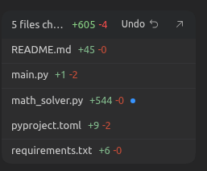
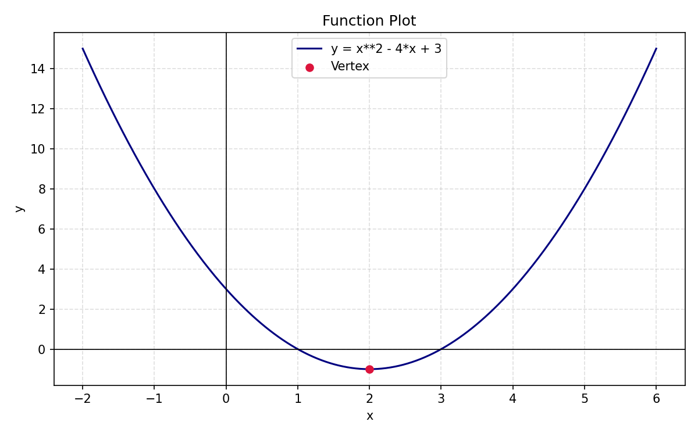

# Week 3 Report: Function Calling, Tools, and LLMs That Can Act

## 1. Three Little Pigs Demo Test

**Configuration**
To run the demo, we created a local `.env` file containing the API details from `apikey.md`. The configuration was set up to use the OpenAI-compatible endpoint for Alibaba Cloud:
*   `OPENAI_API_KEY`: *(Not written for security)*
*   `OPENAI_API_ENDPOINT`: `https://dashscope-intl.aliyuncs.com/compatible-mode/v1`
*   `MODEL`: `qwen3.5-122b-a10b`

**Evidence of Both Scenarios**
*   **Without tools (Scenario 1):** When we ran the no-tool script, we only saw the pig talking and crying but no action was done when threatened.
*   **With tools (Scenario 2):** As shown in the terminal execution, when the wolf escalated the threat by saying *"The door was closed, but the window was open! I have eaten you..."*, the model recognized the danger and used the provided function.
    ```json
    "tool_calls":[
      {
        "id": "call_f7a02b9be3194914824e6523",
        "function": {
          "name": "call_hunter",
          "arguments": "{\"urgency\": \"emergency\", \"message\": \"The Big Bad Wolf is inside my brick house!...\"}"
        }
      }
    ]
    ```
    The application intercepted this, executed `call_hunter()` locally, and returned the output: *"The hunter is sprinting to your location with backup and heavy weapons! Hold on!"*

**What changed when tools were enabled?**
Instead of just responding with natural language about how scared it was, the model's API response structure changed. It returned a structured `tool_calls` JSON array. This paused the conversation, allowing the local Python script to execute an action in the real world (calling the hunter) before sending the result back to the LLM to formulate its final reply.

## 2. Function Calling Explanation

**How function calling works**
Function calling works by sending the LLM a list of available tools (defined as JSON schemas in the OpenAI API standard) alongside the user's prompt. The model reads these descriptions and decides if it needs an external tool to fulfill the user's request. If a tool is needed, the model does not return standard text directly. Instead, it returns a structured JSON object containing the name of the function to call and the specific arguments to pass. The Python script then parses this JSON, executes the real function locally, and sends the output of that function back to the LLM in a second API call. Finally, the LLM uses that real-world output to answer the user.

**The difference between a normal assistant answer and a tool call**
*   **Normal Assistant Answer:** The model responds with a simple text string containing natural language intended directly for the user.
*   **Tool Call:** The model responds with a structured data block (`tool_calls`) meant for the *application* to read. It contains a specific function name and JSON arguments instead of conversational text.

**Why the host program remains in control**
The LLM itself **cannot** execute any code or perform any actions directly. It is only generating text (or JSON). The host Python program remains completely in control because it receives the model's *request* to use a tool, decides whether to allow it, executes the actual code safely on the local machine, and determines what data to send back to the model. The LLM acts only as a decision-maker, while the host program is the executor.

## 3. Math Solver Design

**Our strategy**
We approached the task in two steps. First, we asked ChatGPT to help us write a complete implementation prompt that clearly specified the architecture, required libraries, tool-calling behavior, supported math tasks, and expected CLI behavior. Then we used that prompt to generate the initial version of the math solver, reviewed the produced files, and tested the resulting functions locally.

**Prompt we used to generate the math solver**
```text
Build a complete Python CLI application called `math_solver.py` that follows the same API credential and endpoint pattern as my existing Three Little Pigs function-calling demo, but for a different use case: a small educational math problem solver for secondary-school students.

I want clean, understandable, well-structured code split into multiple functions instead of one huge script.

Context and constraints:
- Use Python.
- Use the OpenAI-compatible Python client from `openai`.
- Load configuration from a local `.env` using `python-dotenv`.
- Reuse the same credential pattern as my current demo:
  - `OPENAI_API_KEY`
  - `OPENAI_API_ENDPOINT` (optional custom base URL)
  - `MODEL` with default fallback like `gpt-4.1-mini`
- The app should accept a math problem from the user in natural language.
- It must use LLM function calling / tools.
- The model must not guess calculations when a tool should be used.
- Real math work must be performed in Python tools.
- It must be able to generate at least one `.png` plot when appropriate.
- It must return a clear final explanation for the user.
- It should handle some invalid input gracefully without crashing.

Supported example requests:
- “Solve 2x + 5 = 17.”
- “What are the roots of x^2 - 5x + 6 = 0?”
- “Evaluate (3/4 + 2/3) * 6.”
- “Factor x^2 + 7x + 12.”
- “Plot y = x^2 - 4x + 3 from x = -2 to x = 6.”
- “What is the vertex of y = x^2 - 6x + 5? Plot it too.”

Requirements:
1. Read API key, endpoint, and model from `.env`
2. Use the same client initialization pattern as my demo
3. Accept a user math problem in natural language from the terminal
4. Provide at least 4 math tools via function calling
5. Execute chosen tools in Python
6. Return a final answer in clear student-friendly language
7. Generate `.png` plots for graphing requests
8. Handle invalid input without crashing
9. Separate logic into multiple functions
10. Show tool calls in the terminal so it is easy to follow
11. Save plots into a `plots/` folder with meaningful unique filenames

Use these libraries:
- `openai`
- `python-dotenv`
- `sympy`
- `matplotlib`
- `pathlib`
- `uuid`

You may also use:
- `numpy`
- `rich`

Please implement the app with a structure like this inside one file unless a second helper file is truly necessary:
- configuration loading
- OpenAI client initialization
- tool schema definitions
- Python implementations of the tools
- chat / reasoning loop with function calling
- CLI entry point

Design rules:
- Keep the tool set small and clear.
- Do not create one mega-function like `do_math_everything()`.
- Each tool should do one job well.
- Prefer clarity over cleverness.
- The code should be understandable by a student reviewing it.

Implement at least these tools:
1. `evaluate_expression(expression: str) -> str`
   - Evaluate arithmetic expressions safely with SymPy
   - Return exact form when possible and numeric approximation when useful

2. `solve_equation(equation: str) -> str`
   - Solve one-variable equations like `2x + 5 = 17` or `x^2 - 5x + 6 = 0`
   - Use SymPy
   - Return solutions clearly

3. `factor_expression(expression: str) -> str`
   - Factor algebraic expressions like `x^2 + 7x + 12`
   - Use SymPy

4. `analyze_quadratic(expression: str) -> str`
   - For expressions like `y = x^2 - 6x + 5` or `x^2 - 6x + 5`
   - Return vertex, axis of symmetry, and roots if available

5. `plot_function(expression: str, x_min: float, x_max: float, output_file: str | None = None) -> str`
   - Generate a `.png` plot using matplotlib
   - Save it to `plots/`
   - Support expressions like `y = x^2 - 4x + 3`
   - Return the saved file path and a short description

Important behavior for the LLM system prompt:
- The assistant is a helpful educational math tutor for high-school students.
- It should explain clearly and step by step.
- It must use tools for arithmetic, algebra, solving, factoring, and plotting instead of guessing.
- It should only answer directly without tools for very minor conversational text.
- If plotting is requested or useful for a quadratic graph question, it should call the plotting tool.
- After tool results are returned, it should give a concise, student-friendly final explanation.

Implementation details:
- Use OpenAI chat completions with `tools=[...]`.
- Detect and execute tool calls in a loop until the model returns a normal final answer.
- Print tool calls and tool results in the terminal.
- Include a clean `SYSTEM_PROMPT`.
- Include robust parsing helpers for math text:
  - Convert `^` to `**`
  - Handle implicit `y = ...` when plotting
  - Handle equations with `=`
  - Use SymPy parsing carefully
- Use `sympy.sympify`, `symbols`, `Eq`, `solve`, `factor`, and related utilities where appropriate.
- For plotting:
  - Use numpy sampling over the given x-range
  - Use matplotlib to save a `.png`
  - Mark the vertex on the graph when the expression is quadratic, if easy to do
- Validate x range for plotting and return a readable error if invalid.
- Create `plots/` automatically if it does not exist.
- Use meaningful plot filenames, e.g. `quadratic_plot_<short_uuid>.png`

User experience:
- Start with a simple terminal prompt like: `Enter a math problem:`
- Run one query, solve it, and print the final explanation.
- After that, optionally ask whether the user wants to solve another problem.
- Keep the CLI simple and reliable.

Output format:
- Return the full code for the application.
- Also include a sample `.env` block.
- Also include a short `requirements.txt` or `uv add ...` line.
- Also include a brief explanation of how the tool-calling flow works in this code.

Please model the coding style after my existing demo:
- readable sections
- clear comments
- configuration near the top
- multiple helper functions
- terminal-friendly output
- straightforward control flow

But adapt it fully to the math-solver use case rather than the Three Little Pigs story.
```

**Files that were modified**


**Description of Chosen Tools**
*   `evaluate_expression(expression)`: parses arithmetic or symbolic input with SymPy, simplifies it, and returns both exact form and a decimal approximation when useful.
*   `solve_equation(equation)`: expects a one-variable equation containing `=`, converts it into a SymPy `Eq`, and solves for `x`.
*   `factor_expression(expression)`: factors algebraic expressions such as quadratics using SymPy's deterministic factoring logic.
*   `analyze_quadratic(expression)`: extracts the quadratic coefficients and returns the standard form, vertex, axis of symmetry, and roots.
*   `plot_function(expression, x_min, x_max, output_file=None)`: uses `numpy` + `matplotlib` to sample points, save a `.png` into `plots/`, and mark the vertex when the function is quadratic.

**Why I limited the tool set**
*   We kept the tool set to five small functions because each tool has one clear responsibility and a narrow schema. That makes it easier for the model to map a user request to the correct function.
*   This is better than a vague "do_math_everything" tool because overlapping tools would make tool choice less reliable and increase the chance of invalid arguments.
*   The implementation also reflects this idea in code: each tool does real math work locally, while the LLM is only responsible for understanding the natural-language request and choosing which tool to call.

**Key Code Fragments**
```python
def solve_with_tools(user_problem: str) -> str:
    messages = build_initial_messages(user_problem)
    tool_registry = get_tool_registry()

    for _ in range(6):
        response = request_completion(messages)
        assistant_message = response.choices[0].message

        if assistant_message.tool_calls:
            append_assistant_tool_call_message(messages, assistant_message)
            for tool_call in assistant_message.tool_calls:
                tool_message = execute_tool_call(tool_call, tool_registry)
                messages.append(tool_message)
            continue

        final_answer = assistant_message.content or "I could not produce a final answer."
        messages.append({"role": "assistant", "content": final_answer})
        return final_answer
```
This is the core orchestration loop. The model first receives the student's prompt plus the JSON tool schemas. If it returns `tool_calls`, the host Python program parses the function name and arguments, executes the matching local function from `tool_registry`, appends the tool result back into the conversation, and asks the model for a final explanation. This makes the LLM an orchestrator, not the calculator itself.

## 4. Testing Evidence

**Math Problems Tried:**
1.  `Solve 2x + 5 = 17`
    Result from the solver: `Solution(s) for x: 6`
2.  `Factor x^2 + 7x + 12`
    Result from the solver: `Factored form: (x + 3)*(x + 4)`
3.  `What is the vertex of y = x^2 - 6x + 5?`
    Result from the solver: vertex `(3, -4)`, axis of symmetry `x = 3`, roots `1, 5`
4.  `Evaluate (3/4 + 2/3) * 6`
    Result from the solver: exact result `17/2`, decimal approximation `8.5`
5.  `Plot y = x^2 - 4x + 3 from x = -2 to x = 6`
    Result from the solver: saved `quadratic_plot_933583cd.png`

**Successful Plot**


**Failure Case Handling**
We tested two failure cases locally. First, we passed `2x + 5` into the equation solver without an equals sign, and the tool returned `The equation must include '='.` Second, we tried an invalid expression, `hello + 2`, and the evaluator returned `Unsupported text in expression: hello`. These cases are handled directly by the implemented validation and `try/except` blocks, so the program returns readable error messages instead of crashing.

## 5. Reflection

*   **What did the model do well?** The design is strong at separating responsibilities. The model can interpret a natural-language request like "What is the vertex..." or "Plot..." and route it to the correct tool, while SymPy and matplotlib handle the exact math and plotting. This is the right use of an LLM: understanding intent and producing the final explanation.
*   **Where did it choose tools badly or fail?** The biggest remaining risk is not arithmetic accuracy inside the tools, but mismatches between user wording and tool arguments. If the model sends malformed math text or chooses a slightly wrong tool, SymPy parsing can fail. The code handles that safely, but the user may still need to rephrase the question.
*   **What did we learn about using LLMs as orchestrators rather than calculators?** We learned that function calling is most useful when the LLM is treated as a controller. The model is good at deciding *what kind of operation is needed*, but the exact computation should be delegated to deterministic software. That gives both flexibility in understanding natural language and reliability in the actual result.
*   **One limitation we noticed:** the final explanation is still generated by the model after the tool call. If the tool only returns final values and not full working steps, the model may invent intermediate reasoning when explaining the answer. A stronger next version would have the tools return structured intermediate steps as well as the final result.

---

## Required Questions

**1. Why is function calling more reliable than asking the model to “just do the math” in plain text?**
LLMs are next-token prediction engines, meaning they essentially guess the most likely next word. They do not have built-in calculators, which makes them highly prone to arithmetic hallucinations. Function calling delegates the actual calculation to deterministic software (like Python functions designed for a certain purpose), ensuring 100% mathematical accuracy.

**2. Why should the available tool set be small and well-defined?**
If there are too many tools or a single "mega-tool," the schema becomes vague. A small, clear toolset minimizes confusion, ensuring the model chooses the correct function (otherwise it might choose the wrong one) and passes the correct arguments without hallucinating parameters.

**3. What is the role of sympy in your solution?**
`sympy` serves as the deterministic mathematical engine. It handles parsing the string expressions passed by the LLM and safely performs symbolic algebra, equation solving, and factoring.

**4. What is the role of matplotlib in your solution?**
`matplotlib` provides a visual artifact for the user. When the LLM recognizes a user wants a graph, it triggers the plotting function, and `matplotlib` translates the mathematical points into a saved `.png` image.

**5. What happens in your program from the moment the user types a problem to the final answer?**
1. User types the prompt.
2. The prompt + tool schemas are sent to the LLM.
3. The LLM returns a `tool_calls` request (e.g., to solve an equation).
4. The Python script intercepts this, parses the arguments, and calls a function that runs the actual `sympy` or `matplotlib` functions.
5. The Python script appends the calculated answer as a `tool` role message and sends it *back* to the LLM.
6. The LLM reads the true answer and generates a final natural-language explanation for the user.

**6. What kinds of errors can still happen even when function calling is used?**
The model might choose the wrong tool for the job, hallucinate arguments that don't match the schema, or pass math syntax that `sympy` fails to parse. The host program must handle these gracefully.

Something we have thaught about is the fact that if the called tool does not provide intermediate steps, the model could be inventing its own steps to reach the final answer, which could lead to hallucinations. This is why an advanced implementation of the tool has to return not just the final answer, but also the intermediate steps, so that the model can use those as a basis for its final explanation to the user.

**7. When should the model answer directly, and when should it call a tool?**
It should answer directly when responding to conversational greetings, explaining a concept, or asking for clarification. It should call a tool the moment a deterministic calculation, factual lookup, or file generation (like a plot) is required to accurately fulfill the prompt.
