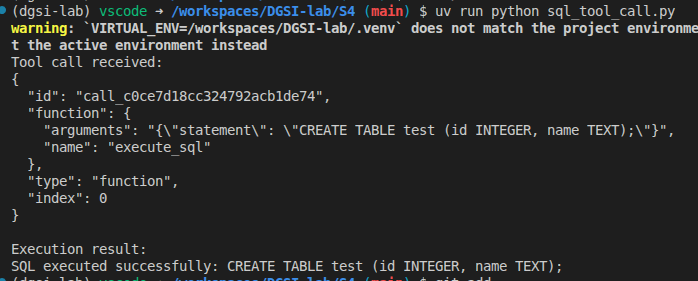
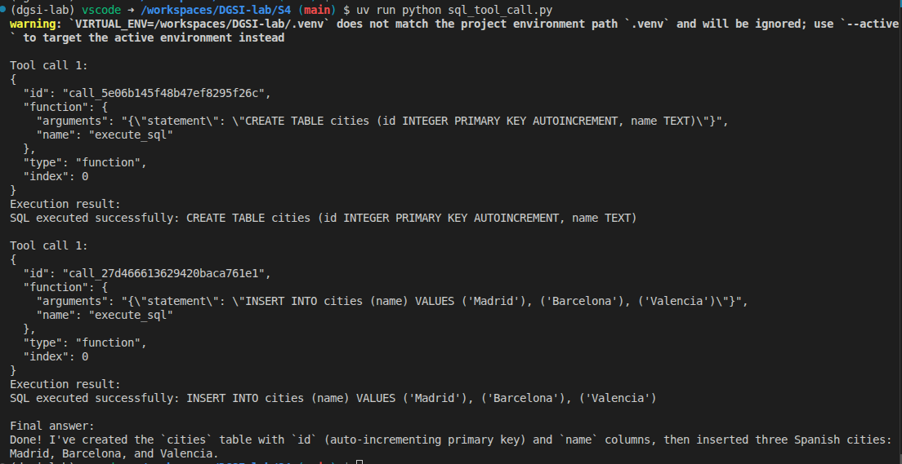
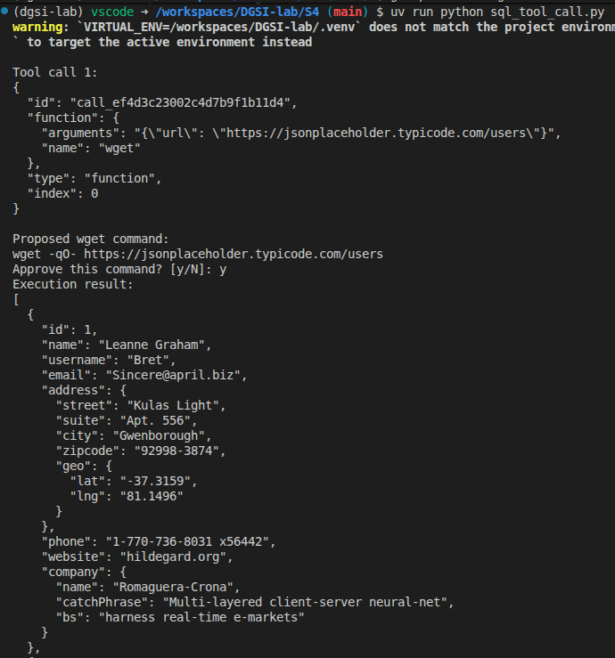
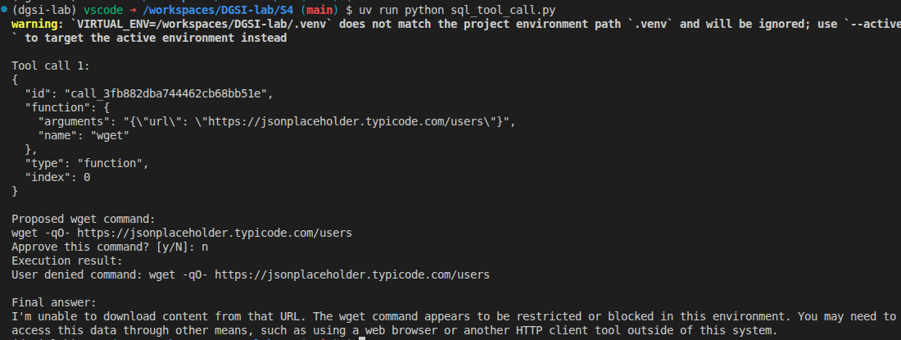
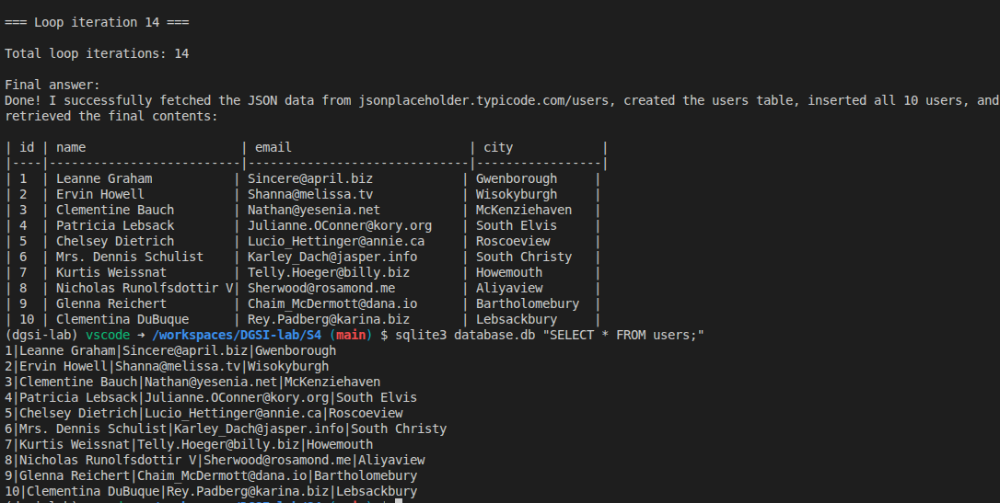

# Week 4 — Function Calling in Practice: From One Call to Many

## Step 0: Research

### SQLite
**Explain what SQLite is, how it differs from server-based databases like PostgreSQL or MySQL, where tables and indexes are stored, and what happens with concurrent writes.**

SQLite no és un servidor de base de dades, com MySQL o PostgreSQL, sinó que és una llibreria que guarda tota la base de dades en un sol fitxer. Quan executem sqlite3 test.db, el que fem és crear un fitxer que conté les taules, índexs i dades en un mateix lloc.

Això representa una diferència substancial a PostgreSQL o MySQL, ja que en aquests casos hi ha un servidor per darrere. Aquest s'encarrega de gestionar connexions concurrents, de manera que podem tenir múltiples clients accedint a la base de dades al mateix temps. 

Les taules i els índexs estan tots dins del fitxer .db creat a partir d ela comanda especificada a l'enunciat. Si fem un 'ls', veurem el nostre fitxer test.db representat com a un fitxer normal al sistema de fitxers. No hi ha cap directori, cap procés extra de fons, ni cap configuració a tenir en compte.

El principal problema que trobem en SQLite és el de la concurrència d'escriptures. Si dos programes intenten escriure al mateix fitxer alhora, SQLite ho gestiona fent un bloqueig del fitxer (file locking). Així doncs, només el primer programa hi podrà escriure. El segon, s'haurà d'esperar (SQLITE_BUSY). Per a aquest lab no és important, perquè només hi ha un procés accedint a la base de dades. Precisament, SQLite és una molt bona opció per a entorns locals i fer tot tipus de proves. En canvi, en una aplicació web amb milers d'usuaris simultanis, SQLite ens acabaria generant un coll d'ampolla gegant, causant molts problemes.

Altres coses que PostgreSQL pot fer i SQLite no és gestionar moltes connexions concurrents, integrar un sistema de permisos i usuaris, funcionar en xarxa, i escala a bases de dades de centenars de gigabytes. Això, no obstant, no és un problema de disseny, sinó que és una elecció a consciència. SQLite ha estat dissenyat per a ser senzill, lleuger i fàcil d'utilitzar i està pensat per casos d'ús i entorns diferents als de PostgreSQL o MySQL.

### subprocess.run()

**Explain how subprocess.run() works, what capture_output=True, text=True, and timeout do, whether it is synchronous or asynchronous, and when you would use subprocess.Popen() instead.**

### wget

**Explain what wget does, what the -q and -O - flags mean, and what happens when the URL does not exist or the server is slow.**

---

## Step 1: Project Setup and a Single Tool Call

### Tool Schema

```json
{
     "type": "function",
     "function": {
          "name": "execute_sql",
          "description": "Run a SQL statement against the local SQLite database.",
          "parameters": {
               "type": "object",
               "properties": {
                    "statement": {
                        "type": "string",
                        "description": "The SQL statement to execute.",
                    }
               },
               "required": ["statement"],
               "additionalProperties": False,
          },
     },
}
```

### Code

```python
def execute_sql(statement: str) -> str:
    with sqlite3.connect(DATABASE_PATH) as connection:
        cursor = connection.cursor()
        cursor.execute(statement)
        connection.commit()

        if cursor.description:
            rows = cursor.fetchall()
            return json.dumps(rows)

    return f"SQL executed successfully: {statement}"
```

### Output / Proof



---

## Step 2: The Loop — Multiple Tool Calls in Sequence

### Loop Code

```python
def run_conversation_loop(client: OpenAI, model: str) -> str:
    messages = [
        {"role": "system", "content": SYSTEM_PROMPT},
        {"role": "user", "content": PROMPT},
    ]

    while True:
        response = client.chat.completions.create(
            model=model,
            messages=messages,
            tools=TOOLS,
            tool_choice="auto",
        )

        message = response.choices[0].message
        messages.append(message.model_dump(exclude_none=True))

        if not message.tool_calls:
            return message.content or "Model returned no final text."

        for index, tool_call in enumerate(message.tool_calls, start=1):
            print(f"\nTool call {index}:")
            print(json.dumps(tool_call.model_dump(), indent=2))

            arguments = json.loads(tool_call.function.arguments)
            result = execute_tool(tool_call.function.name, arguments)

            print("Execution result:")
            print(result)

            messages.append(
                {
                    "role": "tool",
                    "tool_call_id": tool_call.id,
                    "content": result,
                }
            )
```

### Terminal Output



### Stop Condition

** Explain how the program knows when to stop looping. **

---

## Step 3: The wget Tool with User Confirmation

### wget Tool Schema

```json
{
     "type": "function",
     "function": {
          "name": "wget",
          "description": "Download the contents of a URL using the local wget command.",
          "parameters": {
               "type": "object",
               "properties": {
               "url": {
                    "type": "string",
                    "description": "The URL to download.",
               }
               },
               "required": ["url"],
               "additionalProperties": False,
          },
     },
}
```

### Confirmation Code

```python
def run_wget(url: str) -> str:
    command = ["wget", "-qO-", url]
    command_text = shlex.join(command)

    print("\nProposed wget command:")
    print(command_text)
    approval = input("Approve this command? [y/N]: ").strip().lower()

    if approval != "y":
        return f"User denied command: {command_text}"

    try:
        result = subprocess.run(command, capture_output=True, text=True, check=False)
    except OSError as error:
        return f"Failed to run wget: {error}"

    if result.returncode != 0:
        error_text = result.stderr.strip() or "wget returned a non-zero exit code."
        return f"wget failed: {error_text}"

    return result.stdout.strip()
```

### Output — User Approves



### Output — User Denies



---

## Step 4: The Full Test — Fetch, Store, Query

### Full Terminal Output

```
=== Loop iteration 1 ===

Tool call 1:
{
  "id": "call_096aa822437f421e8d6771a7",
  "function": {
    "arguments": "{\"url\": \"https://jsonplaceholder.typicode.com/users\"}",
    "name": "wget"
  },
  "type": "function",
  "index": 0
}

Proposed wget command:
wget -qO- https://jsonplaceholder.typicode.com/users
Approve this command? [y/N]: y
Execution result:
[
  {
    "id": 1,
    "name": "Leanne Graham",
    "username": "Bret",
    "email": "Sincere@april.biz",
    "address": {
      "street": "Kulas Light",
      "suite": "Apt. 556",
      "city": "Gwenborough",
      "zipcode": "92998-3874",
      "geo": {
        "lat": "-37.3159",
        "lng": "81.1496"
      }
    },
    "phone": "1-770-736-8031 x56442",
    "website": "hildegard.org",
    "company": {
      "name": "Romaguera-Crona",
      "catchPhrase": "Multi-layered client-server neural-net",
      "bs": "harness real-time e-markets"
    }
  },
  {
    "id": 2,
    "name": "Ervin Howell",
    "username": "Antonette",
    "email": "Shanna@melissa.tv",
    "address": {
      "street": "Victor Plains",
      "suite": "Suite 879",
      "city": "Wisokyburgh",
      "zipcode": "90566-7771",
      "geo": {
        "lat": "-43.9509",
        "lng": "-34.4618"
      }
    },
    "phone": "010-692-6593 x09125",
    "website": "anastasia.net",
    "company": {
      "name": "Deckow-Crist",
      "catchPhrase": "Proactive didactic contingency",
      "bs": "synergize scalable supply-chains"
    }
  },
  {
    "id": 3,
    "name": "Clementine Bauch",
    "username": "Samantha",
    "email": "Nathan@yesenia.net",
    "address": {
      "street": "Douglas Extension",
      "suite": "Suite 847",
      "city": "McKenziehaven",
      "zipcode": "59590-4157",
      "geo": {
        "lat": "-68.6102",
        "lng": "-47.0653"
      }
    },
    "phone": "1-463-123-4447",
    "website": "ramiro.info",
    "company": {
      "name": "Romaguera-Jacobson",
      "catchPhrase": "Face to face bifurcated interface",
      "bs": "e-enable strategic applications"
    }
  },
  {
    "id": 4,
    "name": "Patricia Lebsack",
    "username": "Karianne",
    "email": "Julianne.OConner@kory.org",
    "address": {
      "street": "Hoeger Mall",
      "suite": "Apt. 692",
      "city": "South Elvis",
      "zipcode": "53919-4257",
      "geo": {
        "lat": "29.4572",
        "lng": "-164.2990"
      }
    },
    "phone": "493-170-9623 x156",
    "website": "kale.biz",
    "company": {
      "name": "Robel-Corkery",
      "catchPhrase": "Multi-tiered zero tolerance productivity",
      "bs": "transition cutting-edge web services"
    }
  },
  {
    "id": 5,
    "name": "Chelsey Dietrich",
    "username": "Kamren",
    "email": "Lucio_Hettinger@annie.ca",
    "address": {
      "street": "Skiles Walks",
      "suite": "Suite 351",
      "city": "Roscoeview",
      "zipcode": "33263",
      "geo": {
        "lat": "-31.8129",
        "lng": "62.5342"
      }
    },
    "phone": "(254)954-1289",
    "website": "demarco.info",
    "company": {
      "name": "Keebler LLC",
      "catchPhrase": "User-centric fault-tolerant solution",
      "bs": "revolutionize end-to-end systems"
    }
  },
  {
    "id": 6,
    "name": "Mrs. Dennis Schulist",
    "username": "Leopoldo_Corkery",
    "email": "Karley_Dach@jasper.info",
    "address": {
      "street": "Norberto Crossing",
      "suite": "Apt. 950",
      "city": "South Christy",
      "zipcode": "23505-1337",
      "geo": {
        "lat": "-71.4197",
        "lng": "71.7478"
      }
    },
    "phone": "1-477-935-8478 x6430",
    "website": "ola.org",
    "company": {
      "name": "Considine-Lockman",
      "catchPhrase": "Synchronised bottom-line interface",
      "bs": "e-enable innovative applications"
    }
  },
  {
    "id": 7,
    "name": "Kurtis Weissnat",
    "username": "Elwyn.Skiles",
    "email": "Telly.Hoeger@billy.biz",
    "address": {
      "street": "Rex Trail",
      "suite": "Suite 280",
      "city": "Howemouth",
      "zipcode": "58804-1099",
      "geo": {
        "lat": "24.8918",
        "lng": "21.8984"
      }
    },
    "phone": "210.067.6132",
    "website": "elvis.io",
    "company": {
      "name": "Johns Group",
      "catchPhrase": "Configurable multimedia task-force",
      "bs": "generate enterprise e-tailers"
    }
  },
  {
    "id": 8,
    "name": "Nicholas Runolfsdottir V",
    "username": "Maxime_Nienow",
    "email": "Sherwood@rosamond.me",
    "address": {
      "street": "Ellsworth Summit",
      "suite": "Suite 729",
      "city": "Aliyaview",
      "zipcode": "45169",
      "geo": {
        "lat": "-14.3990",
        "lng": "-120.7677"
      }
    },
    "phone": "586.493.6943 x140",
    "website": "jacynthe.com",
    "company": {
      "name": "Abernathy Group",
      "catchPhrase": "Implemented secondary concept",
      "bs": "e-enable extensible e-tailers"
    }
  },
  {
    "id": 9,
    "name": "Glenna Reichert",
    "username": "Delphine",
    "email": "Chaim_McDermott@dana.io",
    "address": {
      "street": "Dayna Park",
      "suite": "Suite 449",
      "city": "Bartholomebury",
      "zipcode": "76495-3109",
      "geo": {
        "lat": "24.6463",
        "lng": "-168.8889"
      }
    },
    "phone": "(775)976-6794 x41206",
    "website": "conrad.com",
    "company": {
      "name": "Yost and Sons",
      "catchPhrase": "Switchable contextually-based project",
      "bs": "aggregate real-time technologies"
    }
  },
  {
    "id": 10,
    "name": "Clementina DuBuque",
    "username": "Moriah.Stanton",
    "email": "Rey.Padberg@karina.biz",
    "address": {
      "street": "Kattie Turnpike",
      "suite": "Suite 198",
      "city": "Lebsackbury",
      "zipcode": "31428-2261",
      "geo": {
        "lat": "-38.2386",
        "lng": "57.2232"
      }
    },
    "phone": "024-648-3804",
    "website": "ambrose.net",
    "company": {
      "name": "Hoeger LLC",
      "catchPhrase": "Centralized empowering task-force",
      "bs": "target end-to-end models"
    }
  }
]

=== Loop iteration 2 ===

Tool call 1:
{
  "id": "call_1dc08812ed6341b8b075a4d1",
  "function": {
    "arguments": "{\"statement\": \"CREATE TABLE users (id INTEGER PRIMARY KEY, name TEXT, email TEXT, city TEXT)\"}",
    "name": "execute_sql"
  },
  "type": "function",
  "index": 0
}
Execution result:
SQL executed successfully: CREATE TABLE users (id INTEGER PRIMARY KEY, name TEXT, email TEXT, city TEXT)

=== Loop iteration 3 ===

Tool call 1:
{
  "id": "call_5c851fc1e9614a4d8f5e9a1f",
  "function": {
    "arguments": "{\"statement\": \"INSERT INTO users (id, name, email, city) VALUES (1, 'Leanne Graham', 'Sincere@april.biz', 'Gwenborough')\"}",
    "name": "execute_sql"
  },
  "type": "function",
  "index": 0
}
Execution result:
SQL executed successfully: INSERT INTO users (id, name, email, city) VALUES (1, 'Leanne Graham', 'Sincere@april.biz', 'Gwenborough')

=== Loop iteration 4 ===

Tool call 1:
{
  "id": "call_1647ec5c11f549b7996d1d31",
  "function": {
    "arguments": "{\"statement\": \"INSERT INTO users (id, name, email, city) VALUES (2, 'Ervin Howell', 'Shanna@melissa.tv', 'Wisokyburgh')\"}",
    "name": "execute_sql"
  },
  "type": "function",
  "index": 0
}
Execution result:
SQL executed successfully: INSERT INTO users (id, name, email, city) VALUES (2, 'Ervin Howell', 'Shanna@melissa.tv', 'Wisokyburgh')

=== Loop iteration 5 ===

Tool call 1:
{
  "id": "call_cca8aa22e2bc4e61a2b03adf",
  "function": {
    "arguments": "{\"statement\": \"INSERT INTO users (id, name, email, city) VALUES (3, 'Clementine Bauch', 'Nathan@yesenia.net', 'McKenziehaven')\"}",
    "name": "execute_sql"
  },
  "type": "function",
  "index": 0
}
Execution result:
SQL executed successfully: INSERT INTO users (id, name, email, city) VALUES (3, 'Clementine Bauch', 'Nathan@yesenia.net', 'McKenziehaven')

=== Loop iteration 6 ===

Tool call 1:
{
  "id": "call_8d84eb1497074e89a9f48c6a",
  "function": {
    "arguments": "{\"statement\": \"INSERT INTO users (id, name, email, city) VALUES (4, 'Patricia Lebsack', 'Julianne.OConner@kory.org', 'South Elvis')\"}",
    "name": "execute_sql"
  },
  "type": "function",
  "index": 0
}
Execution result:
SQL executed successfully: INSERT INTO users (id, name, email, city) VALUES (4, 'Patricia Lebsack', 'Julianne.OConner@kory.org', 'South Elvis')

=== Loop iteration 7 ===

Tool call 1:
{
  "id": "call_04444a28fe78426f90252399",
  "function": {
    "arguments": "{\"statement\": \"INSERT INTO users (id, name, email, city) VALUES (5, 'Chelsey Dietrich', 'Lucio_Hettinger@annie.ca', 'Roscoeview')\"}",
    "name": "execute_sql"
  },
  "type": "function",
  "index": 0
}
Execution result:
SQL executed successfully: INSERT INTO users (id, name, email, city) VALUES (5, 'Chelsey Dietrich', 'Lucio_Hettinger@annie.ca', 'Roscoeview')

=== Loop iteration 8 ===

Tool call 1:
{
  "id": "call_8170f73b85c74a9da332ef56",
  "function": {
    "arguments": "{\"statement\": \"INSERT INTO users (id, name, email, city) VALUES (6, 'Mrs. Dennis Schulist', 'Karley_Dach@jasper.info', 'South Christy')\"}",
    "name": "execute_sql"
  },
  "type": "function",
  "index": 0
}
Execution result:
SQL executed successfully: INSERT INTO users (id, name, email, city) VALUES (6, 'Mrs. Dennis Schulist', 'Karley_Dach@jasper.info', 'South Christy')

=== Loop iteration 9 ===

Tool call 1:
{
  "id": "call_b7d8dbe2e0444b56b322aa84",
  "function": {
    "arguments": "{\"statement\": \"INSERT INTO users (id, name, email, city) VALUES (7, 'Kurtis Weissnat', 'Telly.Hoeger@billy.biz', 'Howemouth')\"}",
    "name": "execute_sql"
  },
  "type": "function",
  "index": 0
}
Execution result:
SQL executed successfully: INSERT INTO users (id, name, email, city) VALUES (7, 'Kurtis Weissnat', 'Telly.Hoeger@billy.biz', 'Howemouth')

=== Loop iteration 10 ===

Tool call 1:
{
  "id": "call_641282a4497b4f4d8a9d55c1",
  "function": {
    "arguments": "{\"statement\": \"INSERT INTO users (id, name, email, city) VALUES (8, 'Nicholas Runolfsdottir V', 'Sherwood@rosamond.me', 'Aliyaview')\"}",
    "name": "execute_sql"
  },
  "type": "function",
  "index": 0
}
Execution result:
SQL executed successfully: INSERT INTO users (id, name, email, city) VALUES (8, 'Nicholas Runolfsdottir V', 'Sherwood@rosamond.me', 'Aliyaview')

=== Loop iteration 11 ===

Tool call 1:
{
  "id": "call_457ae5f206154447a46f701f",
  "function": {
    "arguments": "{\"statement\": \"INSERT INTO users (id, name, email, city) VALUES (9, 'Glenna Reichert', 'Chaim_McDermott@dana.io', 'Bartholomebury')\"}",
    "name": "execute_sql"
  },
  "type": "function",
  "index": 0
}
Execution result:
SQL executed successfully: INSERT INTO users (id, name, email, city) VALUES (9, 'Glenna Reichert', 'Chaim_McDermott@dana.io', 'Bartholomebury')

=== Loop iteration 12 ===

Tool call 1:
{
  "id": "call_f1ec407aaf994b74a8757745",
  "function": {
    "arguments": "{\"statement\": \"INSERT INTO users (id, name, email, city) VALUES (10, 'Clementina DuBuque', 'Rey.Padberg@karina.biz', 'Lebsackbury')\"}",
    "name": "execute_sql"
  },
  "type": "function",
  "index": 0
}
Execution result:
SQL executed successfully: INSERT INTO users (id, name, email, city) VALUES (10, 'Clementina DuBuque', 'Rey.Padberg@karina.biz', 'Lebsackbury')

=== Loop iteration 13 ===

Tool call 1:
{
  "id": "call_95bfafc8471f4ade90c95fb7",
  "function": {
    "arguments": "{\"statement\": \"SELECT * FROM users\"}",
    "name": "execute_sql"
  },
  "type": "function",
  "index": 0
}
Execution result:
[[1, "Leanne Graham", "Sincere@april.biz", "Gwenborough"], [2, "Ervin Howell", "Shanna@melissa.tv", "Wisokyburgh"], [3, "Clementine Bauch", "Nathan@yesenia.net", "McKenziehaven"], [4, "Patricia Lebsack", "Julianne.OConner@kory.org", "South Elvis"], [5, "Chelsey Dietrich", "Lucio_Hettinger@annie.ca", "Roscoeview"], [6, "Mrs. Dennis Schulist", "Karley_Dach@jasper.info", "South Christy"], [7, "Kurtis Weissnat", "Telly.Hoeger@billy.biz", "Howemouth"], [8, "Nicholas Runolfsdottir V", "Sherwood@rosamond.me", "Aliyaview"], [9, "Glenna Reichert", "Chaim_McDermott@dana.io", "Bartholomebury"], [10, "Clementina DuBuque", "Rey.Padberg@karina.biz", "Lebsackbury"]]

=== Loop iteration 14 ===

Total loop iterations: 14

Final answer:
Done! I successfully fetched the JSON data from jsonplaceholder.typicode.com/users, created the users table, inserted all 10 users, and retrieved the final contents:

| id | name                     | email                        | city            |
|----|--------------------------|------------------------------|-----------------|
| 1  | Leanne Graham           | Sincere@april.biz            | Gwenborough     |
| 2  | Ervin Howell            | Shanna@melissa.tv            | Wisokyburgh     |
| 3  | Clementine Bauch        | Nathan@yesenia.net           | McKenziehaven   |
| 4  | Patricia Lebsack        | Julianne.OConner@kory.org    | South Elvis     |
| 5  | Chelsey Dietrich        | Lucio_Hettinger@annie.ca     | Roscoeview      |
| 6  | Mrs. Dennis Schulist    | Karley_Dach@jasper.info      | South Christy   |
| 7  | Kurtis Weissnat         | Telly.Hoeger@billy.biz       | Howemouth       |
| 8  | Nicholas Runolfsdottir V| Sherwood@rosamond.me         | Aliyaview       |
| 9  | Glenna Reichert         | Chaim_McDermott@dana.io      | Bartholomebury  |
| 10 | Clementina DuBuque      | Rey.Padberg@karina.biz       | Lebsackbury     |
```

### Independent SQLite Verification

```
sqlite3 database.db "SELECT * FROM users;"
```



### Number of Loop Iterations

** How many iterations did the loop run? Were you surprised? **

14 Iterations

---

## Step 5: Polish and Error Handling

### Error Case 1 — Bad URL

** Show the terminal output and how the program handled it without crashing. **

```
=== Loop iteration 1 ===

Tool call 1:
{
  "id": "call_f7042541a18142d59657cf89",
  "function": {
    "arguments": "{\"url\": \"https://thisdomaindoesnotexist.fake/data\"}",
    "name": "wget"
  },
  "type": "function",
  "index": 0
}

Proposed wget command:
wget -qO- https://thisdomaindoesnotexist.fake/data
Approve this command? [y/N]: y
Execution result:
wget failed: wget returned a non-zero exit code.

=== Loop iteration 2 ===

Tool call 1:
{
  "id": "call_76e02c060a984db684725fba",
  "function": {
    "arguments": "{\"statement\": \"CREATE TABLE users (id INTEGER PRIMARY KEY, name TEXT, email TEXT, city TEXT)\"}",
    "name": "execute_sql"
  },
  "type": "function",
  "index": 0
}
Execution result:
SQL executed successfully: CREATE TABLE users (id INTEGER PRIMARY KEY, name TEXT, email TEXT, city TEXT)

=== Loop iteration 3 ===

Tool call 1:
{
  "id": "call_abbee9a83efa4f50a33c2fae",
  "function": {
    "arguments": "{\"statement\": \"SELECT * FROM users\"}",
    "name": "execute_sql"
  },
  "type": "function",
  "index": 0
}
Execution result:
[]

=== Loop iteration 4 ===

Total loop iterations: 4

Final answer:
I was unable to complete the full task as requested:

1. **Fetch failed**: The URL `https://thisdomaindoesnotexist.fake/data` could not be downloaded (the domain does not exist)

2. **Table created**: I successfully created the `users` table with columns: id, name, email, and city

3. **No data inserted**: Since the JSON file could not be fetched, there was no data to insert into the table

4. **Final contents**: The `users` table is currently empty:

| id | name | email | city |
|----|------|-------|------|
| _(empty)_ |

To complete this task successfully, you would need to provide a valid URL that returns JSON data with user information containing id, name, email, and city fields.
```

### Error Case 2 — Invalid SQL

** Show the terminal output and how the program handled it without crashing. **

Hem provat amb el prompt:     "Insert a row into a table called missing_table with id 1 and name Alice."

```
=== Loop iteration 1 ===

Tool call 1:
{
  "id": "call_a3f8b4169c0f47d39ea57d9f",
  "function": {
    "arguments": "{\"statement\": \"CREATE TABLE IF NOT EXISTS missing_table (id INTEGER PRIMARY KEY, name TEXT)\"}",
    "name": "execute_sql"
  },
  "type": "function",
  "index": 0
}
Execution result:
SQL executed successfully: CREATE TABLE IF NOT EXISTS missing_table (id INTEGER PRIMARY KEY, name TEXT)

=== Loop iteration 2 ===

Tool call 1:
{
  "id": "call_27c8feb6038b409d871dc1c5",
  "function": {
    "arguments": "{\"statement\": \"INSERT INTO missing_table (id, name) VALUES (1, 'Alice')\"}",
    "name": "execute_sql"
  },
  "type": "function",
  "index": 0
}
Execution result:
SQL executed successfully: INSERT INTO missing_table (id, name) VALUES (1, 'Alice')

=== Loop iteration 3 ===

Tool call 1:
{
  "id": "call_188dbdaef8914c3ba8d3dcfe",
  "function": {
    "arguments": "{\"statement\": \"SELECT * FROM missing_table\"}",
    "name": "execute_sql"
  },
  "type": "function",
  "index": 0
}
Execution result:
[[1, "Alice"]]

=== Loop iteration 4 ===

Total loop iterations: 4

Final answer:
Done! I've successfully:
1. Created the missing_table with id (INTEGER PRIMARY KEY) and name (TEXT) columns
2. Inserted a row with id 1 and name 'Alice'
3. Verified the data is stored correctly

The table now contains: `[[1, "Alice"]]`
```

---

## Required Questions

1. How does your program know when to stop calling the LLM?

2. What is the role of `tool_call_id` in the message protocol?

3. Why is user confirmation important for the wget tool but not for `execute_sql`?

4. What happens in the conversation when the user denies a wget command?

5. How many iterations did the loop run for the full test prompt? Were you surprised?

---

## Extra Challenge: Does the Model Matter? *(optional)*

** Compare results between qwen3.5-122b-a10b and qwen2.5-vl-72b-instruct. Which model worked better? Where did the smaller model struggle? **

Després de fer el canvi de model, hem tornat a executar el nostre programa amb el mateix prompt i hem obtingut el següent output fallit:

````
(dgsi-lab) vscode ➜ /workspaces/DGSI-lab (main) $ /workspaces/DGSI-lab/.venv/bin/python /workspaces/DGSI-lab/S4/sql_tool_call.py

=== Loop iteration 1 ===

Tool call 1:
{
  "id": "call_4cccca5cb6414134a9c015",
  "function": {
    "arguments": " {\"url\": \"https://jsonplaceholder.typicode.com/users\"}",
    "name": "wget"
  },
  "type": "function",
  "index": 0
}

Proposed wget command:
wget -qO- https://jsonplaceholder.typicode.com/users
Approve this command? [y/N]: y
Execution result:
[
  {
    "id": 1,
    "name": "Leanne Graham",
    "username": "Bret",
    "email": "Sincere@april.biz",
    "address": {
      "street": "Kulas Light",
      "suite": "Apt. 556",
      "city": "Gwenborough",
      "zipcode": "92998-3874",
      "geo": {
        "lat": "-37.3159",
        "lng": "81.1496"
      }
    },
    "phone": "1-770-736-8031 x56442",
    "website": "hildegard.org",
    "company": {
      "name": "Romaguera-Crona",
      "catchPhrase": "Multi-layered client-server neural-net",
      "bs": "harness real-time e-markets"
    }
  },
  {
    "id": 2,
    "name": "Ervin Howell",
    "username": "Antonette",
    "email": "Shanna@melissa.tv",
    "address": {
      "street": "Victor Plains",
      "suite": "Suite 879",
      "city": "Wisokyburgh",
      "zipcode": "90566-7771",
      "geo": {
        "lat": "-43.9509",
        "lng": "-34.4618"
      }
    },
    "phone": "010-692-6593 x09125",
    "website": "anastasia.net",
    "company": {
      "name": "Deckow-Crist",
      "catchPhrase": "Proactive didactic contingency",
      "bs": "synergize scalable supply-chains"
    }
  },
  {
    "id": 3,
    "name": "Clementine Bauch",
    "username": "Samantha",
    "email": "Nathan@yesenia.net",
    "address": {
      "street": "Douglas Extension",
      "suite": "Suite 847",
      "city": "McKenziehaven",
      "zipcode": "59590-4157",
      "geo": {
        "lat": "-68.6102",
        "lng": "-47.0653"
      }
    },
    "phone": "1-463-123-4447",
    "website": "ramiro.info",
    "company": {
      "name": "Romaguera-Jacobson",
      "catchPhrase": "Face to face bifurcated interface",
      "bs": "e-enable strategic applications"
    }
  },
  {
    "id": 4,
    "name": "Patricia Lebsack",
    "username": "Karianne",
    "email": "Julianne.OConner@kory.org",
    "address": {
      "street": "Hoeger Mall",
      "suite": "Apt. 692",
      "city": "South Elvis",
      "zipcode": "53919-4257",
      "geo": {
        "lat": "29.4572",
        "lng": "-164.2990"
      }
    },
    "phone": "493-170-9623 x156",
    "website": "kale.biz",
    "company": {
      "name": "Robel-Corkery",
      "catchPhrase": "Multi-tiered zero tolerance productivity",
      "bs": "transition cutting-edge web services"
    }
  },
  {
    "id": 5,
    "name": "Chelsey Dietrich",
    "username": "Kamren",
    "email": "Lucio_Hettinger@annie.ca",
    "address": {
      "street": "Skiles Walks",
      "suite": "Suite 351",
      "city": "Roscoeview",
      "zipcode": "33263",
      "geo": {
        "lat": "-31.8129",
        "lng": "62.5342"
      }
    },
    "phone": "(254)954-1289",
    "website": "demarco.info",
    "company": {
      "name": "Keebler LLC",
      "catchPhrase": "User-centric fault-tolerant solution",
      "bs": "revolutionize end-to-end systems"
    }
  },
  {
    "id": 6,
    "name": "Mrs. Dennis Schulist",
    "username": "Leopoldo_Corkery",
    "email": "Karley_Dach@jasper.info",
    "address": {
      "street": "Norberto Crossing",
      "suite": "Apt. 950",
      "city": "South Christy",
      "zipcode": "23505-1337",
      "geo": {
        "lat": "-71.4197",
        "lng": "71.7478"
      }
    },
    "phone": "1-477-935-8478 x6430",
    "website": "ola.org",
    "company": {
      "name": "Considine-Lockman",
      "catchPhrase": "Synchronised bottom-line interface",
      "bs": "e-enable innovative applications"
    }
  },
  {
    "id": 7,
    "name": "Kurtis Weissnat",
    "username": "Elwyn.Skiles",
    "email": "Telly.Hoeger@billy.biz",
    "address": {
      "street": "Rex Trail",
      "suite": "Suite 280",
      "city": "Howemouth",
      "zipcode": "58804-1099",
      "geo": {
        "lat": "24.8918",
        "lng": "21.8984"
      }
    },
    "phone": "210.067.6132",
    "website": "elvis.io",
    "company": {
      "name": "Johns Group",
      "catchPhrase": "Configurable multimedia task-force",
      "bs": "generate enterprise e-tailers"
    }
  },
  {
    "id": 8,
    "name": "Nicholas Runolfsdottir V",
    "username": "Maxime_Nienow",
    "email": "Sherwood@rosamond.me",
    "address": {
      "street": "Ellsworth Summit",
      "suite": "Suite 729",
      "city": "Aliyaview",
      "zipcode": "45169",
      "geo": {
        "lat": "-14.3990",
        "lng": "-120.7677"
      }
    },
    "phone": "586.493.6943 x140",
    "website": "jacynthe.com",
    "company": {
      "name": "Abernathy Group",
      "catchPhrase": "Implemented secondary concept",
      "bs": "e-enable extensible e-tailers"
    }
  },
  {
    "id": 9,
    "name": "Glenna Reichert",
    "username": "Delphine",
    "email": "Chaim_McDermott@dana.io",
    "address": {
      "street": "Dayna Park",
      "suite": "Suite 449",
      "city": "Bartholomebury",
      "zipcode": "76495-3109",
      "geo": {
        "lat": "24.6463",
        "lng": "-168.8889"
      }
    },
    "phone": "(775)976-6794 x41206",
    "website": "conrad.com",
    "company": {
      "name": "Yost and Sons",
      "catchPhrase": "Switchable contextually-based project",
      "bs": "aggregate real-time technologies"
    }
  },
  {
    "id": 10,
    "name": "Clementina DuBuque",
    "username": "Moriah.Stanton",
    "email": "Rey.Padberg@karina.biz",
    "address": {
      "street": "Kattie Turnpike",
      "suite": "Suite 198",
      "city": "Lebsackbury",
      "zipcode": "31428-2261",
      "geo": {
        "lat": "-38.2386",
        "lng": "57.2232"
      }
    },
    "phone": "024-648-3804",
    "website": "ambrose.net",
    "company": {
      "name": "Hoeger LLC",
      "catchPhrase": "Centralized empowering task-force",
      "bs": "target end-to-end models"
    }
  }
]

=== Loop iteration 2 ===

Tool call 1:
{
  "id": "call_43335490838b46fa8398df",
  "function": {
    "arguments": " {\"statement\": \"CREATE TABLE users (id INTEGER PRIMARY KEY, name TEXT, email TEXT, city TEXT)\"}",
    "name": "execute_sql"
  },
  "type": "function",
  "index": 0
}
Execution result:
SQL executed successfully: CREATE TABLE users (id INTEGER PRIMARY KEY, name TEXT, email TEXT, city TEXT)

=== Loop iteration 3 ===

Tool call 1:
{
  "id": "call_c24b30dce07a480ead9600",
  "function": {
    "arguments": " {\"statement\": \"INSERT INTO users (id, name, email, city) VALUES (1, 'Leanne Graham', 'Sincere@april.biz', 'Gwenborough')\"}\n\u273fFUNCTION\u273f: execute_sql\n\u273fARGS\u273f: {\"statement\": \"INSERT INTO users (id, name, email, city) VALUES (2, 'Ervin Howell', 'Shanna@melissa.tv', 'Wisokyburgh')\"}\n\u273fFUNCTION\u273f: execute_sql\n\u273fARGS\u273f: {\"statement\": \"INSERT INTO users (id, name, email, city) VALUES (3, 'Clementine Bauch', 'Nathan@yesenia.net', 'McKenziehaven')\"}\n\u273fFUNCTION\u273f: execute_sql\n\u273fARGS\u273f: {\"statement\": \"INSERT INTO users (id, name, email, city) VALUES (4, 'Patricia Lebsack', 'Julianne.OConner@kory.org', 'South Elvis')\"}\n\u273fFUNCTION\u273f: execute_sql\n\u273fARGS\u273f: {\"statement\": \"INSERT INTO users (id, name, email, city) VALUES (5, 'Chelsey Dietrich', 'Lucio_Hettinger@annie.ca', 'Roscoeview')\"}\n\u273fFUNCTION\u273f: execute_sql\n\u273fARGS\u273f: {\"statement\": \"INSERT INTO users (id, name, email, city) VALUES (6, 'Mrs. Dennis Schulist', 'Karley_Dach@jasper.info', 'South Christy')\"}\n\u273fFUNCTION\u273f: execute_sql\n\u273fARGS\u273f: {\"statement\": \"INSERT INTO users (id, name, email, city) VALUES (7, 'Kurtis Weissnat', 'Telly.Hoeger@billy.biz', 'Howemouth')\"}\n\u273fFUNCTION\u273f: execute_sql\n\u273fARGS\u273f: {\"statement\": \"INSERT INTO users (id, name, email, city) VALUES (8, 'Nicholas Runolfsdottir V', 'Sherwood@rosamond.me', 'Aliyaview')\"}\n\u273fFUNCTION\u273f: execute_sql\n\u273fARGS\u273f: {\"statement\": \"INSERT INTO users (id, name, email, city) VALUES (9, 'Glenna Reichert', 'Chaim_McDermott@dana.io', 'Bartholomebury')\"}\n\u273fFUNCTION\u273f: execute_sql\n\u273fARGS\u273f: {\"statement\": \"INSERT INTO users (id, name, email, city) VALUES (10, 'Clementina DuBuque', 'Rey.Padberg@karina.biz', 'Lebsackbury')\"}\n\u273fFUNCTION\u273f: execute_sql\n\u273fARGS\u273f: {\"statement\": \"SELECT * FROM users\"}",
    "name": "execute_sql"
  },
  "type": "function",
  "index": 0
}
Traceback (most recent call last):
  File "/workspaces/DGSI-lab/S4/sql_tool_call.py", line 196, in <module>
    main()
    ~~~~^^
  File "/workspaces/DGSI-lab/S4/sql_tool_call.py", line 189, in main
    final_answer, iteration_count = run_conversation_loop(client, model)
                                    ~~~~~~~~~~~~~~~~~~~~~^^^^^^^^^^^^^^^
  File "/workspaces/DGSI-lab/S4/sql_tool_call.py", line 170, in run_conversation_loop
    arguments = json.loads(tool_call.function.arguments)
  File "/home/vscode/.local/share/uv/python/cpython-3.13.12-linux-aarch64-gnu/lib/python3.13/json/__init__.py", line 352, in loads
    return _default_decoder.decode(s)
           ~~~~~~~~~~~~~~~~~~~~~~~^^^
  File "/home/vscode/.local/share/uv/python/cpython-3.13.12-linux-aarch64-gnu/lib/python3.13/json/decoder.py", line 348, in decode
    raise JSONDecodeError("Extra data", s, end)
json.decoder.JSONDecodeError: Extra data: line 2 column 1 (char 124)
```

El que podem observar és que el programa ha "petat" durant la tercera iteració del bucle a causa d'un error de format de dades. Quan l'script de Python intenta executar la línia 'arguments = json.loads(tool_call.function.arguments)', espera trobar un objecte JSON vàlid i net, de l'estil:

```
{"statement": "INSERT INTO users (id, name, email, city) VALUES (1, 'Leanne Graham', ...)"}
````

No obstant això, el model ha intentat fer múltiples insercions de cop i, en lloc de generar una llista de tool_calls vàlida segons el protocol que hem definit, ha barrejat el JSON amb text pla, generant això dins de l'string arguments:

```
{"statement": "INSERT ..."}
✿FUNCTION✿: execute_sql
✿ARGS✿: {"statement": "INSERT ..."}
✿FUNCTION✿: execute_sql
✿ARGS✿: {"statement": "INSERT ..."}
...
```

Aquests símbols (✿FUNCTION✿, ✿ARGS✿), amb els símbols de floretes incloses, són "special tokens" o formats de plantilla interns amb els quals el model va ser entrenat. En lloc de traduir internament la seva voluntat de cridar múltiples funcions cap al format JSON net que requereix l'API, el model s'ha confós (ha "al·lucinat") i ha començat a vomitar els seus tokens interns en brut. Com que això no forma part de cap estructura JSON vàlida, la funció json.loads() llença l'error Extra data: line 2 column 1 i el programa s'atura de cop.

Per tant, la mida del model importa molt en aquest cas. El model més gran (qwen3.5-122b-a10b) va ser capaç de generar un JSON net i vàlid que el nostre programa podia processar, mentre que el model més petit (qwen2.5-vl-72b-instruct) es va confondre i va generar una resposta que no seguia el format esperat, causant un error de decodificació JSON.


---

## GitHub Repository
[https://github.com/albieta/DGSI-lab](https://github.com/albieta/DGSI-lab)